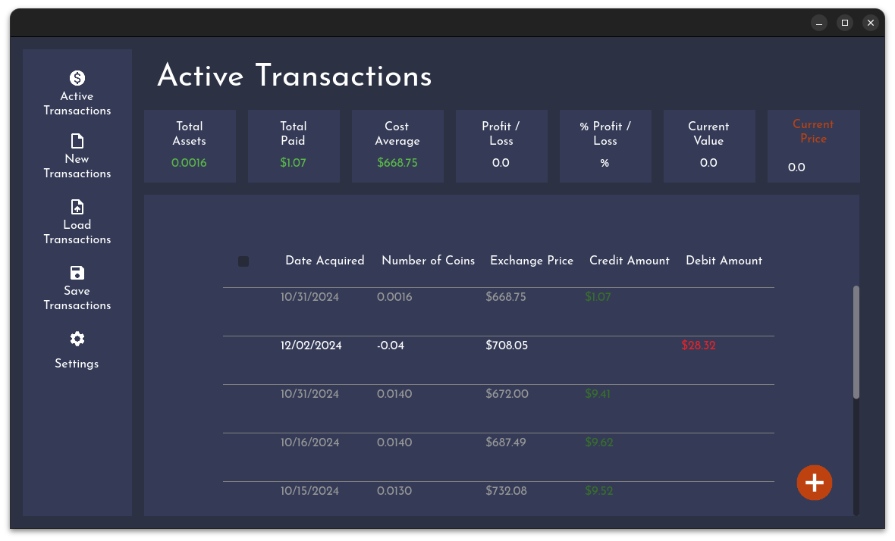
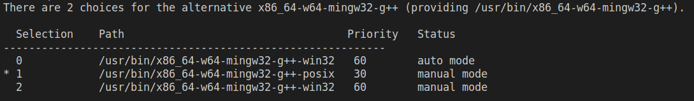
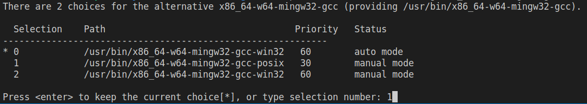
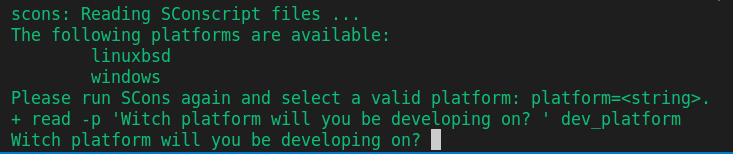

<p align="center">
    
</p>

# AssetTransactionLog
An application to help keep track of fractional assets bought and sold. This application allows efficiently tracking and manageing bought and sold fractional assets records. Offering a clear and organized history with an intuitive user interface. Ideal for those involved in fractional stocks or crypto asset markets.  

This project was build using.
* Python
* Godot
* Gimp
* Ubuntu

## Disclaimer
*All information provided is for informational purposes only. The accuracy, completeness, and timeliness of the information are not guaranteed. By using this AssetTransactionLog application, you acknowledge that any financial decisions or actions taken based on AssetTransactionLog are at your own discretion. We do not assume any liability or responsibility for errors, omissions, or any potential losses resulting from the use of this application. Before making any financial decisions, we recommend consulting with a qualified financial advisor or legal professional who can assess your individual situation and provide tailored advice. This AssetTransactionLog is subject to changes and updates. We are not responsible for any reliance on outdated or inaccurate information.*

# Getting Started
Clone down this repository and install the required tools.
1. Install project dependices.
```
sudo apt install \
  scons \
  pkgconf \
  gcc \
  g++ \
  libx11-dev \
  libxcursor-dev \
  libxinerama-dev \
  libxi-dev \
  libxrandr-dev \
  mesa-dev \
  eudev-dev \
  alsa-lib-dev \
  pulseaudio-dev \
  mingw-w64
```
See [godot engine docs](https://docs.godotengine.org/en/stable/contributing/development/compiling/compiling_for_linuxbsd.html#doc-compiling-for-linuxbsd) for more info.

2. Run update-alternatives for g++ to enable posix threads.
```
sudo update-alternatives --config x86_64-w64-mingw32-g++
```

3. Choose **Number** for option with posix and press Enter. 

<p align="center">
    
</p>

4. Run update-alternatives for gcc to enable posix threads.
```
sudo update-alternatives --config x86_64-w64-mingw32-gcc
```

5. Choose **Number** for option with posix and press Enter. 

<p align="center">
    
</p>

# Compile Godot With Custom Module
AssetTransactionLog uses a custom calcuator module in order to handle floating point rounding erros in the default godot float implemenation. To utilize the custom module the godot engine and templates have to be compiled from source. 
1. Run **SetupGodotEngine** script with desired **godot engine version**.  
*Note: Godot engine version can be found at https://github.com/godotengine/godot/tags*
```
./SetupGodotEngine.sh 4.3
```
2. Enter **linuxbsd** when prompted to choose the target platfrom for developing and runing the applicaiton.

<p align="center">
    
</p>

# Launch Godot Project
1. Navigate to **/GodotEngineSource/godot-4.3-stable/bin/**.
2. Double click **godot.linuxbsd.editor.x86_64**.
3. Click **Import**, navigate to **Development/project.godot** and Click **Open**

<p align="center">
    
</p>